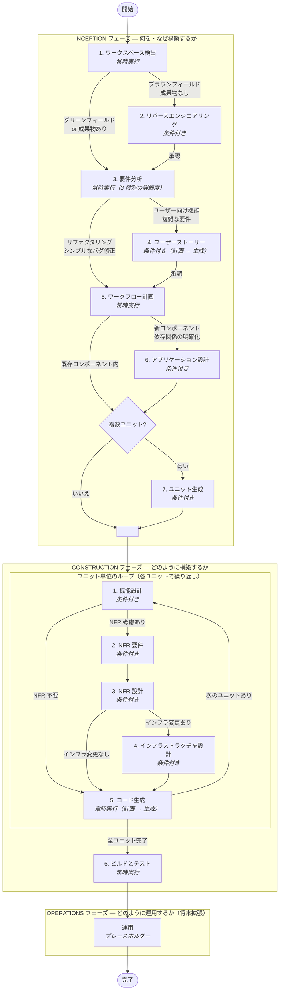

# AIDLC（AI-Driven Development Life Cycle）概要

## 基本理念

> **ワークフローは作業に適応する。その逆ではない。**

AIDLC は、AI モデルがユーザーの意図・コードベースの状態・変更の複雑さ・リスクを評価し、必要なステージだけをインテリジェントに選択・実行するアダプティブなソフトウェア開発ワークフローです。

### 従来のアプローチ（「逆」= やってはいけないこと）

従来の SDLC（ウォーターフォール型など）では、タスクの大小に関係なく全ステージを順番に踏むことが求められがちです。例えば、1行のバグ修正でも「要件定義 → 設計 → 実装 → テスト」をフルに回すような運用です。作業がワークフローに合わせる形になり、軽微な変更に過剰なプロセスが課されます。

### AI-DLC のアプローチ（この原則が目指すもの）

AI-DLC では、AI が以下の4つの要素を評価して必要なステージだけを動的に選択します:

1. ユーザーの意図と明確さ — 曖昧なら深掘り、明確ならスキップ
2. 既存コードベースの状態 — グリーンフィールドかブラウンフィールドかで分岐
3. 変更の複雑さとスコープ — 1コンポーネントなら設計不要、複数なら必要
4. リスクと影響 — 高リスクなら包括的に、低リスクなら最小限に

---

## ワークフロー全体フロー図



> **凡例**: *常時実行* のステージは必ず通過します。*条件付き* のステージはプロジェクトの状態や複雑さに応じてスキップされることがあります。各ステージでユーザーの承認を得てから次へ進みます。

---

## 全体構成（3 フェーズ）

| フェーズ | 目的 | フォーカス |
|---|---|---|
| **INCEPTION** | 計画・要件収集・アーキテクチャ決定 | 何を・なぜ構築するか |
| **CONSTRUCTION** | 詳細設計・NFR 実装・コード生成 | どのように構築するか |
| **OPERATIONS** | デプロイ・モニタリング（将来拡張） | どのように運用するか |

---

## INCEPTION フェーズ

### 1. ワークスペース検出（常時実行）

- 既存の `aidlc-state.md` があれば前回のセッションから再開
- ワークスペースをスキャンし、**ブラウンフィールド**（既存コードあり）か**グリーンフィールド**（新規）かを判定
- 判定結果に基づき、次に進むステージを自動決定

### 2. リバースエンジニアリング（条件付き：ブラウンフィールドのみ）

- **実行条件**: 既存コードベースがあり、過去のリバースエンジニアリング成果物がない場合
- 既存コードを包括的に分析し、以下のドキュメントを生成:
  - ビジネス概要・アーキテクチャ・コード構造
  - API ドキュメント・コンポーネントインベントリ
  - インタラクション図・技術スタック・依存関係
- ユーザーの明示的な承認を得てから次へ進む

### 3. 要件分析（常時実行）

- リクエストの明確さと複雑さに応じて **3 段階の詳細度** で実行:
  - **最小**: シンプルで明確なリクエスト — 意図分析のみ
  - **標準**: 通常の複雑さ — 機能要件・非機能要件を収集
  - **包括的**: 高リスク・複雑 — トレーサビリティ付きの詳細な要件
- 拡張機能（セキュリティ・コンプライアンス等）のオプトイン確認もこのステージで実施

### 4. ユーザーストーリー（条件付き）

- **実行条件**: 新しいユーザー向け機能、複数ペルソナ、複雑なビジネス要件など
- **スキップ条件**: 純粋な内部リファクタリング、シンプルなバグ修正、インフラ変更など
- 2 パート構成:
  1. **計画**: 質問を含むストーリー計画を作成し、曖昧さを解消
  2. **生成**: 承認された計画に基づきストーリーとペルソナを生成

### 5. ワークフロー計画（常時実行）

- これまでの全成果物（リバースエンジニアリング・要件・ストーリー）を入力として使用
- 以降のフェーズで実行するステージとその詳細度を決定
- ワークフロー可視化（Mermaid 図）を生成
- ユーザーは推奨をオーバーライド可能

### 6. アプリケーション設計（条件付き）

- **実行条件**: 新しいコンポーネント/サービスが必要、コンポーネント依存関係の明確化が必要な場合
- **スキップ条件**: 既存コンポーネント内の変更、純粋な実装変更

### 7. ユニット生成（条件付き）

- **実行条件**: システムを複数の作業単位に分解する必要がある場合
- **スキップ条件**: 単一のシンプルなユニット、直接的な単一コンポーネント実装

---

## CONSTRUCTION フェーズ

**ユニット単位のループ**: 各作業単位に対して以下のステージを順番に実行し、1 つのユニットが完全に完了してから次のユニットに移行します。

### 1. 機能設計（条件付き・ユニット単位）

- **実行条件**: 新しいデータモデル/スキーマ、複雑なビジネスロジック
- ビジネスルールの詳細設計を行う

### 2. NFR 要件（条件付き・ユニット単位）

- **実行条件**: パフォーマンス・セキュリティ・スケーラビリティの考慮が必要な場合
- 非機能要件（Non-Functional Requirements）の評価を実施

### 3. NFR 設計（条件付き・ユニット単位）

- **実行条件**: NFR 要件が実行された場合
- NFR パターンを組み込む設計を行う

### 4. インフラストラクチャ設計（条件付き・ユニット単位）

- **実行条件**: デプロイアーキテクチャやクラウドリソースの仕様が必要な場合
- インフラストラクチャサービスのマッピングを行う

### 5. コード生成（常時実行・ユニット単位）

- 各ユニットに対して必ず実行
- 2 パート構成:
  1. **計画**: チェックボックス付きの詳細なコード生成計画を作成
  2. **生成**: 承認された計画に基づきコード・テスト・アーティファクトを生成

### 6. ビルドとテスト（常時実行・全ユニット完了後）

- すべてのユニットの完了後に実行
- 以下のテスト手順を生成:
  - ビルド手順・ユニットテスト・統合テスト
  - パフォーマンステスト（該当する場合）
  - その他（コントラクトテスト・セキュリティテスト・E2E テスト等）

---

## OPERATIONS フェーズ（将来拡張）

現在はプレースホルダーです。将来的に以下が含まれる予定:

- デプロイの計画と実行
- モニタリング・オブザーバビリティのセットアップ
- インシデント対応手順
- 保守・サポートのワークフロー
- 本番稼働チェックリスト

---

## ワークフロー横断の主要原則

| 原則 | 内容 |
|---|---|
| **アダプティブ実行** | 価値を追加するステージのみを実行する |
| **透明な計画** | 実行前に常に計画を表示する |
| **ユーザーコントロール** | ステージの追加/除外をユーザーが要求できる |
| **進捗トラッキング** | `aidlc-state.md` で実行済み/スキップ済みを管理 |
| **完全な監査証跡** | 全ユーザー入力・AI 応答を `audit.md` にタイムスタンプ付きで記録 |
| **コンテンツバリデーション** | ファイル作成前に Mermaid 図・ASCII アート等の構文を検証 |
| **計画チェックボックス強制** | 作業完了と同時にチェックボックスを更新（2 レベルトラッキング） |

---

## ドキュメント構造

```text
<WORKSPACE-ROOT>/
├── [アプリケーションコード]
│
├── aidlc-docs/
│   ├── inception/               # INCEPTION フェーズの成果物
│   │   ├── plans/
│   │   ├── reverse-engineering/
│   │   ├── requirements/
│   │   ├── user-stories/
│   │   └── application-design/
│   ├── construction/            # CONSTRUCTION フェーズの成果物
│   │   ├── plans/
│   │   ├── {unit-name}/
│   │   │   ├── functional-design/
│   │   │   ├── nfr-requirements/
│   │   │   ├── nfr-design/
│   │   │   ├── infrastructure-design/
│   │   │   └── code/
│   │   └── build-and-test/
│   ├── operations/              # OPERATIONS フェーズ（将来拡張）
│   ├── aidlc-state.md           # ワークフロー全体の進捗管理
│   └── audit.md                 # 監査証跡（全操作ログ）
```
