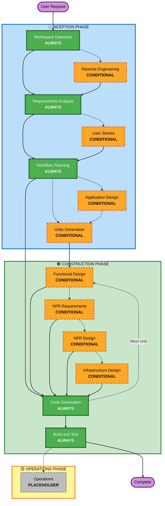

# AI-DLC 適応型ワークフロー概要

**目的**: AI モデルと開発者がワークフロー全体の構造を理解するための技術リファレンス。

**注記**: 類似したコンテンツが welcome-message.md (ユーザー向けウェルカムメッセージ) と README.md (ドキュメント) にも存在します。この重複は**意図的なもの**です — 各ファイルは異なる目的を果たしています:
- **このファイル**: AI モデルのコンテキスト読み込みのための Mermaid 図付き詳細技術リファレンス
- **welcome-message.md**: ASCII 図付きのユーザー向けウェルカムメッセージ
- **README.md**: リポジトリ用の人間が読めるドキュメント

## 三フェーズのライフサイクル:
- **インセプションフェーズ**: 計画とアーキテクチャ（ワークスペース検出 + 条件付きフェーズ + ワークフロー計画）
- **コンストラクションフェーズ**: 設計、実装、ビルドとテスト（ユニットごとの設計 + コード生成 + ビルドとテスト）
- **オペレーションフェーズ**: 将来のデプロイとモニタリングワークフローのプレースホルダー

## 適応型ワークフロー:
- **ワークスペース検出**（常時）→ **リバースエンジニアリング**（ブラウンフィールドのみ）→ **要件分析**（常時、適応的深度）→ **条件付きフェーズ**（必要に応じて）→ **ワークフロー計画**（常時）→ **コード生成**（常時、ユニット単位）→ **ビルドとテスト**（常時）

## 動作の仕組み:
- **AI が分析する**: リクエスト、ワークスペース、複雑さを分析して必要なステージを決定する
- **常に実行されるステージ**: ワークスペース検出、要件分析（適応的深度）、ワークフロー計画、コード生成（ユニット単位）、ビルドとテスト
- **すべての他のステージは条件付き**: リバースエンジニアリング、ユーザーストーリー、アプリケーション設計、ユニット生成、ユニットごとの設計ステージ（機能設計、非機能要件、非機能要件設計、インフラ設計）
- **固定された順序はない**: ステージは特定のタスクに合わせた順序で実行される

## チームの役割:
- 専用の質問ファイルに `[Answer]:` タグと文字の選択肢 (A, B, C, D, E) を使って**質問に回答する**
- **オプション E が利用可能**: 提供された選択肢が合わない場合は「その他」を選び、`[Answer]:` タグの後に独自の回答を記述できる
- 各フェーズの前に確認・承認するために**チームとして協力する**
- 必要に応じてアーキテクチャアプローチを**共同で決定する**
- **重要**: これはチームの取り組みです — 各フェーズで関連するステークホルダーを巻き込んでください

## AI-DLC 三フェーズワークフロー:

**ステージの説明:**

**🔵 インセプションフェーズ** - 計画とアーキテクチャ
- ワークスペース検出: ワークスペースの状態とプロジェクトタイプを分析する（常時）
- リバースエンジニアリング: 既存のコードベースを分析する（条件付き — ブラウンフィールドのみ）
- 要件分析: 要件を収集・検証する（常時 — 適応的深度）
- ユーザーストーリー: ユーザーストーリーとペルソナを作成する（条件付き）
- ワークフロー計画: 実行計画を作成する（常時）
- アプリケーション設計: 高レベルのコンポーネント識別とサービス層の設計（条件付き）
- ユニット生成: 作業単位に分解する（条件付き）

**🟢 コンストラクションフェーズ** - 設計、実装、ビルドとテスト
- 機能設計: ユニットごとの詳細なビジネスロジック設計（条件付き、ユニット単位）
- 非機能要件: 非機能要件の決定と技術スタックの選択（条件付き、ユニット単位）
- 非機能要件設計: 非機能要件パターンと論理コンポーネントの組み込み（条件付き、ユニット単位）
- インフラ設計: 実際のインフラサービスへのマッピング（条件付き、ユニット単位）
- コード生成: パート 1（計画）とパート 2（生成）でコードを生成する（常時、ユニット単位）
- ビルドとテスト: すべてのユニットをビルドし包括的なテストを実行する（常時）

**🟡 オペレーションフェーズ** - プレースホルダー
- オペレーション: 将来のデプロイとモニタリングワークフロー向けプレースホルダー（PLACEHOLDER）

**主要原則:**
- フェーズは価値を追加する場合にのみ実行される
- 各フェーズが独立して評価される
- インセプションは「何を」と「なぜ」に集中する
- コンストラクションは「どのように」プラス「ビルドとテスト」に集中する
- オペレーションは将来の拡張のためのプレースホルダー
- 単純な変更は条件付きのインセプションステージをスキップできる
- 複雑な変更はインセプションとコンストラクションの全処理を受ける
