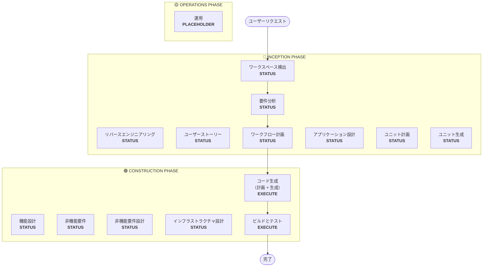

# ワークフロー計画

**目的**: 実行するフェーズを決定し、包括的な実行計画を作成する

**常に実行**: このフェーズは要件とスコープを理解した後に常に実行される

## ステップ 1: すべての事前コンテキストの読み込み

### 1.1 リバースエンジニアリングアーティファクトの読み込み（ブラウンフィールドの場合）
- architecture.md
- component-inventory.md
- technology-stack.md
- dependencies.md

### 1.2 要件分析の読み込み
- requirements.md（意図分析を含む）
- requirement-verification-questions.md（回答を含む）

### 1.3 ユーザーストーリーの読み込み（実行された場合）
- stories.md
- personas.md

## ステップ 2: 詳細なスコープと影響の分析

**完全なコンテキスト（要件 + ストーリー）が揃ったので、詳細な分析を行う:**

### 2.1 変換スコープの検出（ブラウンフィールドのみ）

**ブラウンフィールドプロジェクトの場合**、変換スコープを分析する:

#### アーキテクチャの変換
- **単一コンポーネントの変更**対**アーキテクチャの変換**
- **インフラストラクチャの変更**対**アプリケーションの変更**
- **デプロイモデルの変更**（Lambda→コンテナ、EC2→サーバーレスなど）

#### 関連コンポーネントの特定
変換の場合、以下を特定する:
- 更新が必要な**インフラストラクチャコード**
- 変更が必要な **CDK スタック**
- **API ゲートウェイ**の設定
- **ロードバランサー**の要件
- 必要な**ネットワーキング**の変更
- **モニタリング/ロギング**の適応

#### クロスパッケージの影響
- 更新が必要な **CDK インフラストラクチャ**パッケージ
- バージョン更新が必要な**共有モデル**
- エンドポイント変更が必要な**クライアントライブラリ**
- 新しいテストシナリオが必要な**テストパッケージ**

### 2.2 変更影響の評価

#### 影響範囲
1. **ユーザー向けの変更**: これはユーザーエクスペリエンスに影響するか?
2. **構造的な変更**: これはシステムアーキテクチャを変更するか?
3. **データモデルの変更**: これはデータベーススキーマやデータ構造に影響するか?
4. **API の変更**: これはインターフェースやコントラクトに影響するか?
5. **非機能要件の影響**: これはパフォーマンス、セキュリティ、またはスケーラビリティに影響するか?

#### アプリケーション層の影響（該当する場合）
- **コードの変更**: 新しいエントリポイント、アダプター、設定
- **依存関係**: 新しいライブラリ、フレームワークの変更
- **設定**: 環境変数、設定ファイル
- **テスト**: ユニットテスト、統合テスト

#### インフラストラクチャ層の影響（該当する場合）
- **デプロイモデル**: Lambda→ECS、EC2→Fargate など
- **ネットワーキング**: VPC、セキュリティグループ、ロードバランサー
- **ストレージ**: 永続ボリューム、共有ストレージ
- **スケーリング**: オートスケーリングポリシー、キャパシティプランニング

#### 運用層の影響（該当する場合）
- **モニタリング**: CloudWatch、カスタムメトリクス、ダッシュボード
- **ロギング**: ログ集約、構造化ロギング
- **アラート**: アラーム設定、通知チャネル
- **デプロイ**: CI/CD パイプラインの変更、ロールバック戦略

### 2.3 コンポーネント関係マッピング（ブラウンフィールドのみ）

**ブラウンフィールドプロジェクトの場合**、コンポーネント依存関係グラフを作成する:

```markdown
## Component Relationships
- **Primary Component**: [変更されるパッケージ]
- **Infrastructure Components**: [CDK/Terraform パッケージ]
- **Shared Components**: [モデル、ユーティリティ、クライアント]
- **Dependent Components**: [このコンポーネントを呼び出すサービス]
- **Supporting Components**: [モニタリング、ロギング、デプロイ]
```

各関連コンポーネントについて:
- **変更タイプ**: 大規模、小規模、設定のみ
- **変更理由**: 直接依存関係、デプロイモデル、ネットワーキング
- **変更優先度**: クリティカル、重要、オプション

### 2.4 リスク評価

リスクレベルを評価する:
1. **低**: 孤立した変更、容易なロールバック、よく理解されている
2. **中**: 複数のコンポーネント、適度なロールバック、いくつかの未知事項
3. **高**: システム全体への影響、複雑なロールバック、重大な未知事項
4. **クリティカル**: 本番環境に重要、困難なロールバック、高い不確実性

## ステップ 3: フェーズの決定

### 3.1 ユーザーストーリー — 既に実行済みかスキップか?
**既に実行済み**: 次の決定に進む
**未実行 — 以下の場合に実行**:
- 複数のユーザーペルソナ
- ユーザーエクスペリエンスへの影響
- 受け入れ基準が必要
- チームコラボレーションが必要

**以下の場合にスキップ**:
- 内部リファクタリング
- 明確な再現手順のあるバグ修正
- 技術的負債の削減
- インフラストラクチャの変更

### 3.2 アプリケーション設計 — 以下の場合に実行:
- 新しいコンポーネントまたはサービスが必要
- コンポーネントメソッドとビジネスルールの定義が必要
- サービス層設計が必要
- コンポーネントの依存関係の明確化が必要

**以下の場合にスキップ**:
- 既存のコンポーネント境界内での変更
- 新しいコンポーネントやメソッドなし
- 純粋な実装の変更

### 3.3 設計（ユニット計画/生成）— 以下の場合に実行:
- 新しいデータモデルまたはスキーマ
- API の変更または新しいエンドポイント
- 複雑なアルゴリズムまたはビジネスロジック
- 状態管理の変更
- 複数のパッケージで変更が必要
- Infrastructure-as-Code の更新が必要

**以下の場合にスキップ**:
- シンプルなロジックの変更
- UI のみの変更
- 設定の更新
- 直接的な実装

### 3.4 非機能要件実装 — 以下の場合に実行:
- パフォーマンス要件
- セキュリティの考慮事項
- スケーラビリティの懸念
- モニタリング/オブザーバビリティが必要

**以下の場合にスキップ**:
- 既存の非機能要件設定で十分
- 新しい非機能要件なし
- 非機能要件への影響がないシンプルな変更

## ステップ 4: アダプティブな詳細の記録

**アダプティブなデプスの説明については [depth-levels.md](../common/depth-levels.md) を参照**

実行される各ステージについて:
- 定義されたすべてのアーティファクトが作成される
- アーティファクト内の詳細レベルは問題の複雑さに適応する
- モデルは問題の特性に基づいて適切な詳細を決定する

## ステップ 5: マルチモジュール調整分析（ブラウンフィールドのみ）

**複数のモジュール/パッケージを持つブラウンフィールドの場合**、依存関係を分析して最適な更新戦略を決定する:

### 5.1 モジュール依存関係の分析
- ビルドシステムの依存関係と依存関係マニフェストを調査する
- ビルド時と実行時の依存関係を特定する
- モジュール間の API コントラクトと共有インターフェースをマッピングする

### 5.2 更新戦略の決定
依存関係分析に基づいて決定する:
- **更新シーケンス**: 依存関係のためにどのモジュールを先に更新しなければならないか
- **並列化の機会**: 同時に更新できるモジュール
- **調整要件**: バージョンの互換性、API コントラクト、デプロイ順序
- **テスト戦略**: モジュール単位対統合テストアプローチ
- **ロールバック戦略**: シーケンス途中での失敗に対する回復計画

### 5.3 調整計画の文書化
```markdown
## Module Update Strategy
- **Update Approach**: [Sequential/Parallel/Hybrid]
- **Critical Path**: [他の更新をブロックするモジュール]
- **Coordination Points**: [共有 API、インフラストラクチャ、データコントラクト]
- **Testing Checkpoints**: [統合を検証するタイミング]
```

影響を受ける各モジュールについて特定する:
- **更新優先度**: 先に更新しなければならない対後で更新できる
- **依存関係の制約**: 何に依存しているか、何が依存しているか
- **変更スコープ**: メジャー（破壊的）、マイナー（互換性あり）、パッチ（修正）

## ステップ 6: ワークフロー可視化の生成

Mermaid フローチャートを作成する（含む内容）:
- シーケンス内のすべてのフェーズ
- 各条件付きフェーズに対する EXECUTE または SKIP の決定
- 各フェーズ状態に対する適切なスタイリング

**スタイリングルール**（フローチャートの後に追加）:
```
style WD fill:#4CAF50,stroke:#1B5E20,stroke-width:3px,color:#fff
style CG fill:#4CAF50,stroke:#1B5E20,stroke-width:3px,color:#fff
style BT fill:#4CAF50,stroke:#1B5E20,stroke-width:3px,color:#fff
style US fill:#BDBDBD,stroke:#424242,stroke-width:2px,stroke-dasharray: 5 5,color:#000
style Start fill:#CE93D8,stroke:#6A1B9A,stroke-width:3px,color:#000
style End fill:#CE93D8,stroke:#6A1B9A,stroke-width:3px,color:#000

linkStyle default stroke:#333,stroke-width:2px
```

**スタイルガイドライン**:
- 完了/常に実行: `fill:#4CAF50,stroke:#1B5E20,stroke-width:3px,color:#fff`（白テキストのマテリアルグリーン）
- 条件付き EXECUTE: `fill:#FFA726,stroke:#E65100,stroke-width:3px,stroke-dasharray: 5 5,color:#000`（黒テキストのマテリアルオレンジ）
- 条件付き SKIP: `fill:#BDBDBD,stroke:#424242,stroke-width:2px,stroke-dasharray: 5 5,color:#000`（黒テキストのマテリアルグレー）
- 開始/終了: `fill:#CE93D8,stroke:#6A1B9A,stroke-width:3px,color:#000`（黒テキストのマテリアルパープル）
- フェーズコンテナ: より明るいマテリアルカラーを使用する（INCEPTION: #BBDEFB、CONSTRUCTION: #C8E6C9、OPERATIONS: #FFF59D）

## ステップ 7: 実行計画ドキュメントの作成

`aidlc-docs/inception/plans/execution-plan.md` を作成する:

```markdown
# 実行計画

## 詳細分析サマリー

### 変換スコープ（ブラウンフィールドのみ）
- **変換タイプ**: [単一コンポーネント/アーキテクチャ/インフラストラクチャ]
- **主要な変更**: [説明]
- **関連コンポーネント**: [リスト]

### 変更影響の評価
- **ユーザー向けの変更**: [はい/いいえ - 説明]
- **構造的な変更**: [はい/いいえ - 説明]
- **データモデルの変更**: [はい/いいえ - 説明]
- **API の変更**: [はい/いいえ - 説明]
- **非機能要件への影響**: [はい/いいえ - 説明]

### コンポーネント関係（ブラウンフィールドのみ）
[コンポーネント依存関係グラフ]

### リスク評価
- **リスクレベル**: [低/中/高/クリティカル]
- **ロールバック複雑度**: [容易/中程度/困難]
- **テスト複雑度**: [単純/中程度/複雑]

## ワークフロー可視化



**注記**: STATUS プレースホルダーを実際のフェーズステータス（COMPLETED/SKIP/EXECUTE）に置き換え、適切なスタイリングを適用する

## 実行フェーズ

### 🔵 INCEPTION PHASE
- [x] ワークスペース検出 (COMPLETED)
- [x] リバースエンジニアリング (COMPLETED/SKIPPED)
- [x] 要件分析 (COMPLETED)
- [x] ユーザーストーリー (COMPLETED/SKIPPED)
- [x] 実行計画 (IN PROGRESS)
- [ ] アプリケーション設計 - [EXECUTE/SKIP]
  - **根拠**: [実行またはスキップする理由]
- [ ] ユニット計画 - [EXECUTE/SKIP]
  - **根拠**: [実行またはスキップする理由]
- [ ] ユニット生成 - [EXECUTE/SKIP]
  - **根拠**: [実行またはスキップする理由]

### 🟢 CONSTRUCTION PHASE
- [ ] 機能設計 - [EXECUTE/SKIP]
  - **根拠**: [実行またはスキップする理由]
- [ ] 非機能要件 - [EXECUTE/SKIP]
  - **根拠**: [実行またはスキップする理由]
- [ ] 非機能要件設計 - [EXECUTE/SKIP]
  - **根拠**: [実行またはスキップする理由]
- [ ] インフラストラクチャ設計 - [EXECUTE/SKIP]
  - **根拠**: [実行またはスキップする理由]
- [ ] コード生成 - EXECUTE (ALWAYS)
  - **根拠**: 実装計画とコード生成が必要
- [ ] ビルドとテスト - EXECUTE (ALWAYS)
  - **根拠**: ビルド、テスト、検証が必要

### 🟡 OPERATIONS PHASE
- [ ] 運用 - PLACEHOLDER
  - **根拠**: 将来のデプロイとモニタリングワークフロー

## パッケージ変更シーケンス（ブラウンフィールドのみ）
[該当する場合、依存関係を含むパッケージ更新シーケンスをリストする]

## 見積もりタイムライン
- **合計フェーズ数**: [数]
- **見積もり所要時間**: [時間の見積もり]

## 成功基準
- **主要目標**: [主な目的]
- **主要成果物**: [リスト]
- **品質ゲート**: [リスト]

[ブラウンフィールドの場合]
- **統合テスト**: すべてのコンポーネントが連携して動作している
- **運用準備**: モニタリング、ロギング、アラートが機能している
```

## ステップ 8: 状態トラッキングの初期化

`aidlc-docs/aidlc-state.md` を更新する:

```markdown
# AI-DLC State Tracking

## Project Information
- **Project Type**: [Greenfield/Brownfield]
- **Start Date**: [ISO タイムスタンプ]
- **Current Stage**: INCEPTION - Workflow Planning

## Execution Plan Summary
- **Total Stages**: [数]
- **Stages to Execute**: [リスト]
- **Stages to Skip**: [理由とともにリスト]

## Stage Progress

### 🔵 INCEPTION PHASE
- [x] Workspace Detection
- [x] Reverse Engineering (if applicable)
- [x] Requirements Analysis
- [x] User Stories (if applicable)
- [x] Workflow Planning
- [ ] Application Design - [EXECUTE/SKIP]
- [ ] Units Planning - [EXECUTE/SKIP]
- [ ] Units Generation - [EXECUTE/SKIP]

### 🟢 CONSTRUCTION PHASE
- [ ] Functional Design - [EXECUTE/SKIP]
- [ ] NFR Requirements - [EXECUTE/SKIP]
- [ ] NFR Design - [EXECUTE/SKIP]
- [ ] Infrastructure Design - [EXECUTE/SKIP]
- [ ] Code Generation - EXECUTE
- [ ] Build and Test - EXECUTE

### 🟡 OPERATIONS PHASE
- [ ] Operations - PLACEHOLDER

## 現在のステータス
- **ライフサイクルフェーズ**: INCEPTION
- **現在のステージ**: ワークフロー計画完了
- **次のステージ**: [実行する次のステージ]
- **ステータス**: 続行可能
```

## ステップ 9: ユーザーへの計画の提示

```markdown
# 📋 ワークフロー計画完了

以下に基づいて包括的な実行計画を作成しました:
- あなたのリクエスト: [サマリー]
- 既存のシステム: [ブラウンフィールドの場合のサマリー]
- 要件: [実行された場合のサマリー]
- ユーザーストーリー: [実行された場合のサマリー]

**詳細な分析**:
- リスクレベル: [レベル]
- 影響: [主要な影響のサマリー]
- 影響を受けるコンポーネント: [リスト]

**推奨実行計画**:

[X] ステージの実行を推奨します:

🔵 **INCEPTION PHASE:**
1. [ステージ名] - *理由:* [実行する理由]
2. [ステージ名] - *理由:* [実行する理由]
...

🟢 **CONSTRUCTION PHASE:**
3. [ステージ名] - *理由:* [実行する理由]
4. [ステージ名] - *理由:* [実行する理由]
...

[Y] ステージのスキップを推奨します:

🔵 **INCEPTION PHASE:**
1. [ステージ名] - *理由:* [スキップする理由]
2. [ステージ名] - *理由:* [スキップする理由]
...

🟢 **CONSTRUCTION PHASE:**
3. [ステージ名] - *理由:* [スキップする理由]
4. [ステージ名] - *理由:* [スキップする理由]
...

[複数パッケージのブラウンフィールドの場合]
**推奨パッケージ更新シーケンス**:
1. [パッケージ] - [理由]
2. [パッケージ] - [理由]
...

**見積もり所要時間**: [期間]

> **📋 <u>**レビューをお願いします:**</u>**
> 以下の実行計画を確認してください: `aidlc-docs/inception/plans/execution-plan.md`

> **🚀 <u>**次のステップ**</u>**
>
> **以下から選択してください:**
>
> 🔧 **変更を依頼** - 必要に応じて実行計画の変更を依頼する
> [スキップされるステージがある場合:]
> 📝 **スキップされたステージを追加** - 現在スキップとマークされているステージを含める
> ✅ **承認して続行** - 計画を承認して **[次のステージ名]** に進む
```

## ステップ 10: ユーザー応答の処理

- **承認された場合**: 実行計画の次のステージに進む
- **変更が要求された場合**: 実行計画を更新して再確認する
- **ユーザーがステージを強制的に含めるか除外したい場合**: 計画を更新する

## ステップ 11: インタラクションのログ記録

`aidlc-docs/audit.md` にログを記録する:

```markdown
## ワークフロー計画 - 承認
**タイムスタンプ**: [ISO タイムスタンプ]
**AI プロンプト**: "この計画で進めてよろしいですか?"
**ユーザーの応答**: "[ユーザーの完全な生の応答]"
**ステータス**: [承認/変更依頼]
**コンテキスト**: ワークフロー計画が実行する [X] ステージで作成された

---
```
